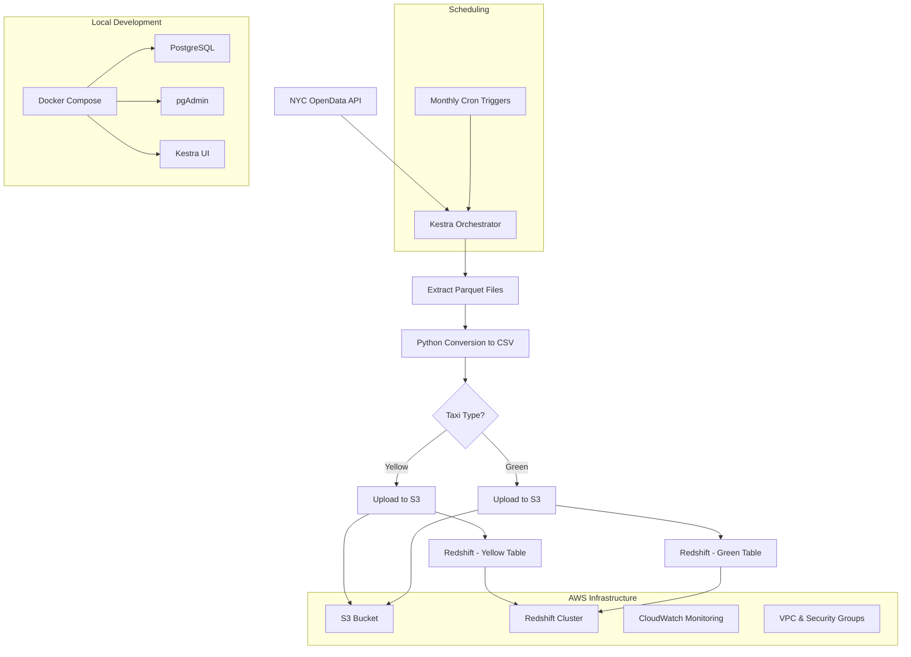

# YG-Pipeline

A comprehensive data engineering project that orchestrates NYC taxi trip data processing using **Kestra**, deployed on **AWS** infrastructure with **Terraform**. This pipeline automates the extraction, transformation, and loading of taxi trip data into a cloud data warehouse.

## 🏗️ Architecture Overview



## 🚀 Features

- **Automated Data Pipeline**: Monthly scheduled extraction of NYC taxi trip data
- **Multi-Taxi Type Support**: Handles both Yellow and Green taxi data
- **Cloud-Native**: Deployed on AWS with S3 storage and Redshift warehouse
- **Infrastructure as Code**: Complete AWS infrastructure managed with Terraform
- **Containerized Development**: Local development environment with Docker Compose
- **Data Transformation**: Parquet to CSV conversion with pandas
- **Monitoring Ready**: CloudWatch integration for pipeline monitoring

## 📁 Project Structure

```
├── .dockerignore           # Docker build exclusions
├── .gitignore             # Git exclusions
├── docker/
│   └── docker-compose.yml # Local development stack
├── flows/
│   └── taks.yaml          # Kestra workflow definition
├── terraform/
│   └── main.tf            # AWS infrastructure definition
├── requirements.txt       # Python dependencies
├── setup.py              # Project setup utilities
└── README.md             # This file
```

## 🛠️ Technology Stack

- **Orchestration**: Kestra v0.20.7
- **Cloud Provider**: AWS (S3, Redshift, CloudWatch, VPC)
- **Infrastructure**: Terraform
- **Containerization**: Docker & Docker Compose
- **Database**: PostgreSQL (local), Redshift (production)
- **Programming**: Python, SQL
- **Data Processing**: Pandas, PyArrow

## 📋 Prerequisites

- Docker & Docker Compose
- Terraform >= 1.0
- AWS CLI configured
- Python 3.8+

## 🚀 Quick Start

### 1. Local Development Setup

```bash
# Clone the repository
git clone <repository-url>
cd nyc-taxi-pipeline

# Start local development environment
cd docker
docker-compose up -d

# Access services
# Kestra UI: http://localhost:8080
# pgAdmin: http://localhost:8085 (admin@admin.com / root)
```

### 2. AWS Infrastructure Deployment

```bash
# Navigate to terraform directory
cd terraform

# Create credentials file (cred.json)
cat > cred.json << EOF
{
  "region": "us-east-1",
  "access_key": "YOUR_ACCESS_KEY",
  "secret_key": "YOUR_SECRET_KEY"
}
EOF

# Initialize and deploy infrastructure
terraform init
terraform plan
terraform apply
```

### 3. Configure Kestra Secrets

In Kestra UI, configure the following KV pairs:
- `access-key`: Your AWS access key
- `secret-key`: Your AWS secret key
- `aws_region`: AWS region (e.g., us-east-1)
- `bucket`: S3 bucket name
- `redshift_url`: Redshift JDBC URL
- `redshift_username`: Redshift username
- `redshift_password`: Redshift password

## 🔄 Pipeline Workflow

The pipeline (`flows/taks.yaml`) orchestrates the following steps:

1. **Extract**: Downloads parquet files from NYC OpenData CloudFront CDN
2. **Transform**: Converts parquet to CSV using pandas
3. **Load**: Uploads CSV to S3 bucket
4. **Warehouse**: Creates tables and loads data into Redshift
5. **Cleanup**: Purges temporary files

### Supported Taxi Types
- **Yellow Taxi**: Manhattan taxi trips
- **Green Taxi**: Outer borough taxi trips

### Scheduling
- Automatically runs monthly on the 1st day of each month
- Separate triggers for Yellow and Green taxi data
- Supports manual execution with custom parameters

## 📊 Data Schema

### Yellow Taxi Data
```sql
CREATE TABLE yellow_tripdata (
    VendorID INTEGER,
    tpep_pickup_datetime TIMESTAMP,
    tpep_dropoff_datetime TIMESTAMP,
    passenger_count REAL,
    trip_distance REAL,
    -- ... additional columns
);
```

### Green Taxi Data
```sql
CREATE TABLE green_tripdata (
    VendorID INTEGER,
    lpep_pickup_datetime TIMESTAMP,
    lpep_dropoff_datetime TIMESTAMP,
    passenger_count REAL,
    trip_distance REAL,
    -- ... additional columns
);
```

## 🔧 Configuration

### Environment Variables
Set these in your Kestra KV store:
- `access-key`: AWS Access Key ID
- `secret-key`: AWS Secret Access Key
- `aws_region`: AWS Region
- `bucket`: S3 Bucket Name
- `redshift_url`: Redshift Connection URL
- `redshift_username`: Redshift Username
- `redshift_password`: Redshift Password

### Input Parameters
- `taxi`: Taxi type (green/yellow)
- `year`: Data year (2014-2025)
- `month`: Data month (1-12)

## 📈 Monitoring & Observability

- **Kestra UI**: Pipeline execution monitoring
- **CloudWatch**: AWS resource monitoring
- **S3 Lifecycle**: Automatic data cleanup after 3 days
- **Execution Logs**: Detailed logging for troubleshooting

## 🔒 Security

- VPC with private subnets
- Security groups with restricted access
- IAM roles with minimal required permissions
- Encrypted S3 storage
- Secrets management via Kestra KV store

## 🤝 Contributing

1. Fork the repository
2. Create a feature branch (`git checkout -b feature/amazing-feature`)
3. Commit your changes (`git commit -m 'Add some amazing feature'`)
4. Push to the branch (`git push origin feature/amazing-feature`)
5. Open a Pull Request

## 📝 License

This project is licensed under the MIT License - see the LICENSE file for details.

## 👨‍💻 Author

**HAMZA-BOUALI**
- Project: YG-PIPELINE
- Environment: Ubuntu 22-LTS 


## 🐛 Troubleshooting

### Common Issues

1. **Kestra Connection Failed**
   ```bash
   # Check if containers are running
   docker ps
   
   # Restart services
   docker-compose restart
   ```

2. **AWS Credentials Error**
   ```bash
   # Verify AWS CLI configuration
   aws sts get-caller-identity
   ```

3. **Terraform Deployment Issues**
   ```bash
   # Check Terraform state
   terraform show
   
   # Force refresh
   terraform refresh
   ```

## 📚 Additional Resources

- [Kestra Documentation](https://kestra.io/docs)
- [NYC Taxi Data](https://www.nyc.gov/site/tlc/about/tlc-trip-record-data.page)
- [AWS Redshift Documentation](https://docs.aws.amazon.com/redshift/)
- [Terraform AWS Provider](https://registry.terraform.io/providers/hashicorp/aws/latest/docs)

---

⭐ If you find this project helpful, please give it a star!
